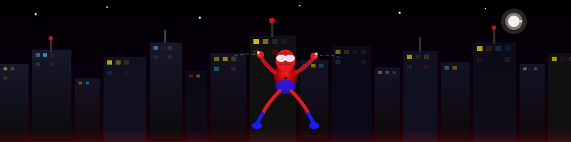

<!-- HERO -->
<div align="center">
  
</div>

<!-- CINEMATIC SPIDER-MAN BANNER -->
<div align="center">
  
</div>

<br/>

<!-- TYPING SVG -->
<div align="center">
  <a href="https://git.io/typing-svg">
    
  </a>
</div>

<br/>

<!-- BADGES -->
<div align="center">

[](https://aksharmadan.vercel.app)
[](https://www.linkedin.com/in/akshar-madan-539896323/)
[](mailto:aksharmadan000@gmail.com)
[](https://github.com/Aksharmadan)

</div>

<br/>

---

## 🕷️ `< The Origin Story />`


```javascript
const akshar = {
  name        : "Akshar Madan",
  university  : "SRM IST, Chennai",
  degree      : "B.Tech CSE — Cloud Computing",
  cgpa        :  8.65,
  role        : ["Full Stack Dev", "ML Researcher"],
  superpower  : "Builds the web 🕷️",
  status      : "🟢 AVAILABLE FOR HIRE",
  location    : "Chennai, India 🇮🇳",
  certifications : 12,
  repos       : 21,
  hackathons  : 3
};
```

> *"Not bitten by a radioactive spider — just obsessed with the web."*

- 🔭 **UROP Research** — Smart Demand Forecasting using ML at SRMIST
- 🌱 Deep-diving into **Advanced Cloud Architecture & AI/ML Systems**
- 🚀 Creator of **[aksharmadan.vercel.app](https://aksharmadan.vercel.app)** — a cinematic Spider-Man portfolio
- 💼 Open to **internships**, **full-time roles** & **collaborations**

<br clear="right"/>

---

<div align="center">
  
</div>

## 🛠️ `< Arsenal />`

<div align="center">

**Languages**


**Frameworks & Tools**


</div>

---

## 📊 `< Mission Stats />`

<div align="center">
  
  &nbsp;&nbsp;
  
</div>

<br/>

<div align="center">
  
</div>

<br/>

<div align="center">

| 🗂️ Repos | 🏅 Certifications | 🎯 Hackathons | ⭐ CGPA |
|:---------:|:-----------------:|:-------------:|:-------:|
| **21** | **12** | **3** | **8.65** |

</div>

---

<div align="center">
  
</div>

## 🚀 `< Featured Mission — Spider-Man Portfolio />`

<div align="center">

> ### *🎬 A dark, cinematic, scroll-driven experience. Like stepping inside a Marvel movie.*

<a href="https://aksharmadan.vercel.app">
  
</a>

<br/><br/>

| Feature | Description |
|:-------:|:-----------|
| 🌆 **NYC Skyline** | Rain · Lightning · Aurora · Parallax depth |
| 🕷️ **Spidey** | Scroll-driven movement · Cursor tracking · Speech bubbles |
| 🎮 **WEB.RUNNER** | Full endless runner game built in HTML5 Canvas |
| 💻 **Terminal** | Boot terminal · VS Code bio · Matrix rain |
| ✨ **VFX** | Liquid cursor · Shockwaves · Gold dust · Film grain |
| 🏆 **Secrets** | Konami code · Achievement system · Hidden room |

</div>

```
Built with:  Vanilla JS   Vite   HTML5 Canvas   CSS3 Animations   25+ custom effects
```

---

<div align="center">
  
</div>

## 🏅 `< Certifications />`

<div align="center">

| | Certification | Issuer | Badge |
|:--:|:-------------|:------:|:-----:|
| ☁️ | Google Cloud Data Analytics | Google Cloud | ✅ |
| 🔒 | Google Cloud Cybersecurity | Google Cloud | ✅ |
| 🤖 | Oracle AI Foundations Associate | Oracle | ✅ |
| 🐍 | 100 Days of Code — Python Bootcamp | Udemy | ✅ |
| 💻 | Software Engineer Certification | HackerRank | ✅ |
| 🌐 | Web Development Fundamentals | IBM SkillsBuild | ✅ |
| 📊 | McKinsey Forward Program | McKinsey & Co. | ✅ |
| 🏦 | Quantitative Research Job Simulation | J.P. Morgan | ✅ |
| 📈 | GenAI Powered Data Analytics | Tata | ✅ |
| 🔧 | Technology Job Simulation | Deloitte | ✅ |
| 🖥️ | AICTE Elevate Virtual Internship | Microsoft | ✅ |
| 📐 | OOP with Java Fundamentals | NPTEL IIT Kharagpur | ✅ |

</div>

<div align="center">

[](https://www.credly.com/users/akshar-madan)

</div>

---

## 🔬 `< Research Mission />`

<div align="center">
<table width="80%">
<tr>
<td>

### 📊 Smart Demand Forecasting in Transportation & Logistics Using ML

**`UROP — SRMIST`** &nbsp;·&nbsp; **`Aug 2025 – Present`** &nbsp;·&nbsp; 🟢 **ACTIVE**

```python
research = {
    "institution" : "SRM Institute of Science & Technology",
    "program"     : "Undergraduate Research Opportunities Program",
    "domain"      : "Transportation & Logistics",
    "topic"       : "Smart Demand Forecasting Using ML",
    "methods"     : ["Regression Analysis", "Time Series Forecasting",
                     "Feature Engineering", "Model Evaluation"],
    "tools"       : ["Python", "Scikit-learn", "Pandas", "Matplotlib"],
    "status"      : "🟢 ACTIVE"
}
```

</td>
</tr>
</table>
</div>

---

## 🎯 `< Hackathons />`

<div align="center">

```
╔══════════════════════════════════════════════════════════════════════╗
║                                                                      ║
║   🏗️  ORGANIZING  ──▶   Heisen Hack     │  SRM ACM   │  Dec 2025   ║
║   💡  COMPETED    ──▶   Pitch & Patch   │  Alexa     │  Jan 2026   ║
║   🚀  COMPETED    ──▶   IDEANOVA 2.0    │  Newton    │  Nov 2025   ║
║                                                                      ║
╚══════════════════════════════════════════════════════════════════════╝
```

</div>

---

## 📈 `< Activity />`

<div align="center">
  
</div>

---

<div align="center">
  
</div>

## 🌐 `< Send The Signal />`

<div align="center">

<a href="https://aksharmadan.vercel.app">
  
</a>

<br/><br/>

<a href="https://www.linkedin.com/in/akshar-madan-539896323/">
  
</a>
&nbsp;
<a href="https://github.com/Aksharmadan">
  
</a>
&nbsp;
<a href="https://www.hackerrank.com/profile/aksharmadan000">
  
</a>

<br/><br/>

<a href="https://leetcode.com/u/zuzVBU5EdU/">
  
</a>
&nbsp;
<a href="https://www.credly.com/users/akshar-madan">
  
</a>
&nbsp;
<a href="mailto:aksharmadan000@gmail.com">
  
</a>

<br/><br/>


&nbsp;


</div>

<br/>

<!-- FOOTER -->
<div align="center">
  
</div>
